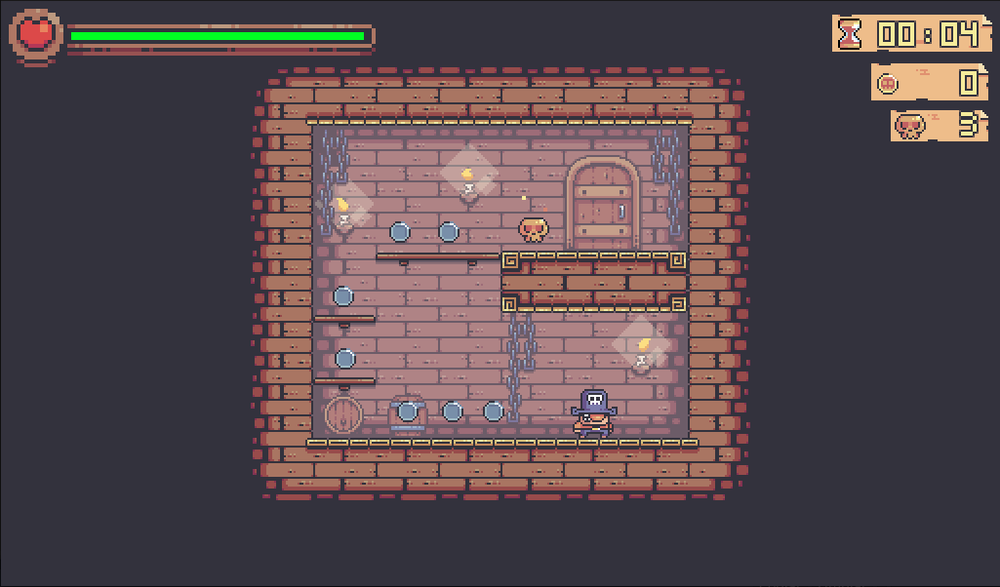
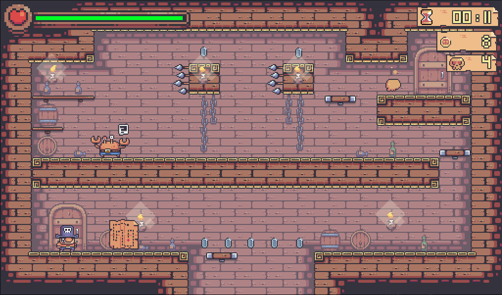

# Treasure Hunters (Juego ejemplo en Godot)



Juego con fines didacticos de plataformas, empleando el engine [Godot 3.x.x](https://godotengine.org/).

# Probar demo
* Enlace del juego.

# Instalación
Descarga Godot Engine 3.x y carga el proyecto. Puedes ejecutarlo con F5 o cargar nivel por nivel, desde la carpeta niveles.

# Descripción
En la carepta niveles esta en detalle como se trabajo con cada parte del juego

```
niveles/
├── nivel_1_movimiento_player/
├── nivel_2_animaciones/
├── nivel_3_juntar_monedas/
├── nivel_4_romper_objetos/
├── nivel_5_vida_y_trampas/
├── nivel_6_enemigos_melee/
├── nivel_7_enemigos_rango/
├── nivel_8_transicion_de_escenas/
├── nivel_9_plataformas_moviles/
├── nivel_10_save_system/   // sistema de guardado
├── nivel_11_ui/
└── nivel_x_full_waltrough/ // juego completo
```
